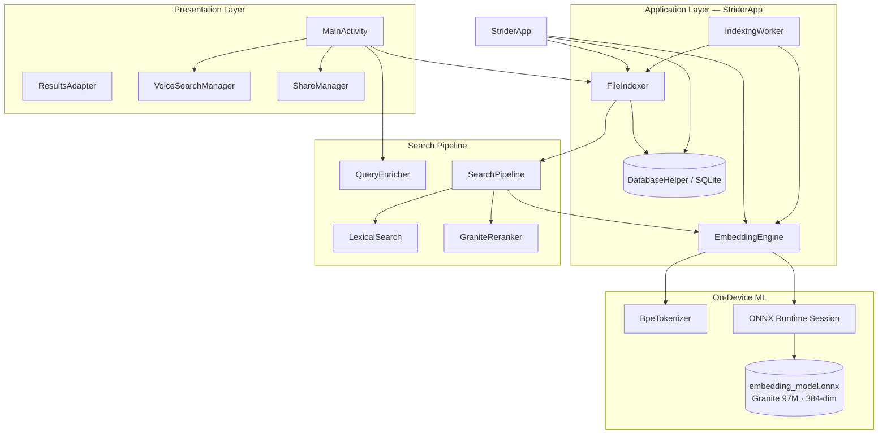
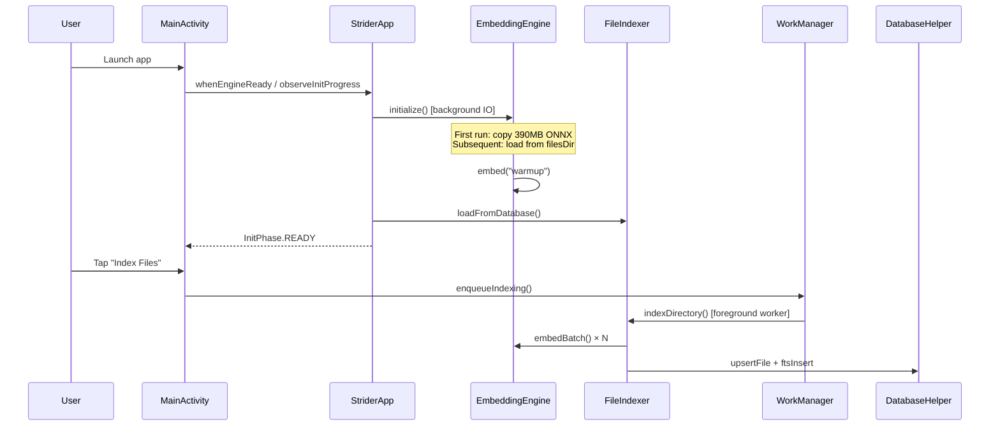
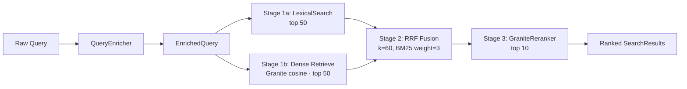
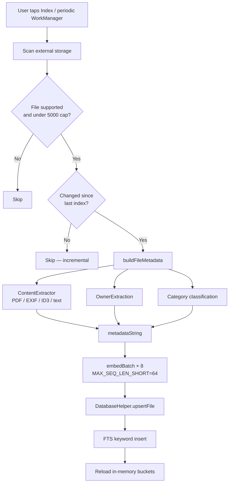

# RU (Strider Quanto)

**On-device, multilingual semantic search for files on Android.**

RU finds documents, photos, and media on your phone using natural language — in Hindi, English, Hinglish, and many other languages — without sending your files or queries to the cloud. All indexing, embedding, and ranking runs locally via ONNX Runtime and SQLite.

| | |
|---|---|
| **Platform** | Android 8.0+ (API 26), target SDK 34 |
| **Language** | Kotlin 1.9 |
| **Embedding model** | IBM Granite Embedding 97M Multilingual (`granite-embedding-97m-multilingual-r2`) |
| **Inference** | ONNX Runtime Android 1.17.3 |
| **Storage** | SQLite + FTS5 (with FTS4 fallback) |
| **Privacy** | 100% on-device; no network required for search |

---

## Table of Contents

1. [Overview](#overview)
2. [Features](#features)
3. [Architecture](#architecture)
4. [Search Pipeline](#search-pipeline)
5. [Indexing Pipeline](#indexing-pipeline)
6. [Embedding Model](#embedding-model)
7. [Data Model](#data-model)
8. [Project Structure](#project-structure)
9. [Getting Started](#getting-started)
10. [Configuration](#configuration)
11. [Performance Benchmarks](#performance-benchmarks)
12. [Privacy & Permissions](#privacy--permissions)
13. [Supported File Types](#supported-file-types)
14. [Troubleshooting](#troubleshooting)
15. [Limitations & Roadmap](#limitations--roadmap)

---

## Overview

Most file managers search by filename. RU goes further:

- **Semantic search** — query *"budget spreadsheet from last quarter"* and find `Q3_finance.xlsx` even when the filename says nothing about budgets.
- **Lexical search** — fast keyword matching on filenames, folder paths, extracted content snippets, and metadata.
- **Hybrid retrieval** — both signals are fused with Reciprocal Rank Fusion (RRF), then reranked with a Granite bi-encoder + metadata overlap stage (production RAG pattern).
- **Multilingual queries** — conversational Hindi/English/Hinglish and cross-script token bridging.
- **Personal search** — *"mera Aadhaar"*, *"Ram Kumar's PAN"* using on-device name extraction from filenames and document content.
- **Voice search** — speak a query via Android's speech recognizer (requires network for Google's STT on most devices).
- **Share intents** — *"share my invoice on WhatsApp"* opens a file picker and routes to the target app.

The app is designed for mid-range ARM devices (e.g. Snapdragon 439 class) with careful attention to thermal load, battery, and background indexing via WorkManager.

---

## Features

### Search

| Feature | Description |
|---------|-------------|
| **Hybrid retrieval** | Lexical + dense semantic branches, RRF fusion, Granite rerank |
| **Live preview** | Lexical-only results while typing; full pipeline on explicit Search |
| **Query enrichment** | Strips filler words, expands synonyms, detects category/time/type/owner intent |
| **Category hints** | Identity, Work, Education, Personal, Media buckets boost relevant files |
| **Time hints** | *"recent"*, *"this week"*, *"last year"* map to age buckets |
| **Owner matching** | Filename + content name extraction; user profile for possessive queries |
| **Semantic toggle** | Disable AI matching in Settings for lexical-only mode |

### Indexing

| Feature | Description |
|---------|-------------|
| **Background indexing** | WorkManager foreground service survives app close and Doze |
| **Incremental updates** | Skips unchanged files (mtime + size hash); periodic 24h re-scan |
| **Priority directories** | Documents, Downloads, DCIM, WhatsApp, etc. indexed first |
| **Batched inference** | 8 files per ONNX forward pass |
| **Content extraction** | PDF text, image EXIF, audio ID3 tags, archive listing, plain text |
| **FTS keyword index** | SQLite FTS5 for auxiliary keyword storage and backfill |

### UX

| Feature | Description |
|---------|-------------|
| **One-time model setup** | ~390 MB model copied to `filesDir` on first install; warm session thereafter |
| **Onboarding** | Optional name capture for personalized *"my document"* searches |
| **Three screens** | Home (search), Index (progress), Settings |
| **Notifications** | Live indexing progress with tap-to-open |

---

## Architecture

### High-Level System Diagram



### Application Lifecycle

The ONNX session is owned by `StriderApp` (not `MainActivity`) so it survives activity recreation, app switching, and screen-off. The model is copied once to `filesDir` (not `cacheDir`, which Android may clear).



### Module Responsibilities

| Module | Role |
|--------|------|
| `StriderApp` | Process-scoped engine, indexer, DB; init progress; WorkManager scheduling |
| `EmbeddingEngine` | ONNX session lifecycle, BPE tokenization, single + batch embed, cosine similarity |
| `BpeTokenizer` | Parses `tokenizer.json`; Granite special tokens (`<|startoftext|>`, `<|return|>`) |
| `FileIndexer` | Storage walk, metadata build, batched embedding, in-memory category buckets |
| `DatabaseHelper` | SQLite persistence, embedding blobs, FTS5/FTS4 virtual table |
| `IndexingWorker` | WorkManager coroutine worker with foreground notification |
| `SearchPipeline` | Orchestrates lexical → dense → RRF → rerank |
| `QueryEnricher` | Query parsing, synonym expansion, owner intent, multilingual forms |
| `LexicalSearch` | In-memory weighted token scoring (no ONNX) |
| `GraniteReranker` | Second-stage bi-encoder + metadata overlap scoring |
| `ContentExtractor` | PDF, EXIF, ID3, ZIP listing, text signal extraction |
| `MultilingualBridge` | Cross-script tokens, stop words, language hints |
| `OwnerExtraction` / `OwnerMatcher` | Name entities from filenames and document text |
| `UserProfile` | On-device display name for possessive queries |
| `MainActivity` | ViewBinding UI, debounced search, voice, share flow |

---

## Search Pipeline

RU implements a **hybrid retrieval pipeline** aligned with BEIR/RAG production patterns: retrieve broadly from multiple signals, fuse rankings, then rerank top candidates.



### Stage 1a — Lexical Search

`LexicalSearch` scores every indexed file stub in memory using weighted token overlap:

- **Filename stem** — highest weight (exact match = 100, prefix/suffix = 80, contains = 50)
- **Extension, folder, metadata string, content snippet** — descending weights
- **Synonym tokens** — only for vague single-token queries
- **Boosts** — category match (×1.15), time bucket (×1.1), media type filter (×1.8 for matching ext)
- **Owner multiplier** — from `OwnerMatcher` for *"my"* / named queries

No SQLite FTS or ONNX is used at search time for the primary lexical path — ensuring consistent, query-specific scoring.

### Stage 1b — Dense Retrieval

When semantic search is enabled:

1. Embed the cleaned query (`FIXED_SEQ_LEN = 128`).
2. Build a candidate set from lexical top-30 plus category-filtered stubs (up to 400–800 paths).
3. Load embeddings from SQLite for candidates only (lazy, not full corpus scan).
4. Rank by cosine similarity (L2-normalized vectors).

### Stage 2 — Reciprocal Rank Fusion

```text
RRF_score(path) = 1.5 / (60 + lexical_rank) + 1 / (60 + dense_rank)
```

Lexical hits receive 1.5× weight (`SearchWeights.LEXICAL_RRF_WEIGHT`) because filename matches are often decisive. Filename and content SQL hits are pinned into the rerank pool regardless of RRF rank.

**Token matching:** queries use word-boundary matching for tokens ≥3 chars; short tokens (1–2 chars) match via stem-token prefix/suffix only (see `SearchWeights` KNOWN_LIMITATIONS).

### Stage 3 — Granite Reranker

`GraniteReranker` approximates cross-encoder interaction using:

- Granite bi-encoder cosine similarity (query vs file embedding)
- Normalized lexical score with adaptive weights (lex-heavy when filename match is strong; dense-heavy when lexical is weak)
- Token overlap on metadata string, content snippet, and filename
- Specificity multiplier, language hint multiplier, category/time/owner boosts

Final score is clamped to `[0, 1]` and displayed as a percentage in the UI.

### Query Enrichment Examples

| Raw query | Clean embed query | Detected signals |
|-----------|-------------------|------------------|
| *"find my aadhaar card please"* | `aadhaar card` | Owner: SELF, Category: IDENTITY |
| *"Q2 budget report"* | `q2 budget report` | Period: Q2, Category: WORK |
| *"python notes in hindi"* | `python notes hindi` | Language: HINDI, Category: EDUCATION |
| *"share invoice on whatsapp"* | `invoice` | Action: share, Target: whatsapp |

---

## Indexing Pipeline



### Priority Scan Order

Files under these paths are indexed first so useful results appear within ~30 seconds of starting:

```text
Documents → Download(s) → DCIM → Camera → WhatsApp → Media → Pictures → Music → Movies → rest
```

### Incremental Indexing

Each file record stores `last_modified` and `size_bytes`. On re-index:

- **Unchanged files** — skipped entirely (no re-embedding).
- **New/changed files** — re-embedded and upserted.
- **Deleted files** — removed from DB when absent from disk scan.

Periodic WorkManager job runs every 24 hours (battery-not-low constraint) for incremental updates.

### Metadata String Composition

Each file's embedding input is a rich text string built from:

- Normalized filename and extension
- Parent folder name
- Category labels and type label
- Content snippet (up to ~800 chars from PDF/text)
- Owner name tokens
- Filename entities (dates, quarters, document numbers)
- PDF metadata (title, author)
- Multilingual keyword extras

This is why semantic search works on cryptic filenames like `IMG_20240315.jpg` — the embedded string includes extracted signals, not just the raw name.

---

## Embedding Model

| Property | Value |
|----------|-------|
| **Model** | IBM Granite Embedding 97M Multilingual R2 |
| **Architecture** | ModernBERT (`ModernBertModel`) |
| **Hidden size** | 384 |
| **Layers / heads** | 12 / 12 |
| **Vocab size** | 180,000 (BPE) |
| **Output** | Mean-pooled, L2-normalized 384-dim vector |
| **ONNX asset** | `app/src/main/assets/embedding_model.onnx` (~390 MB) |
| **Tokenizer** | `tokenizer.json` + `tokenizer_config.json` |

### Inference Parameters

| Parameter | Indexing | Search query |
|-----------|----------|--------------|
| Sequence length | 64 (`MAX_SEQ_LEN_SHORT`) | 128 (`FIXED_SEQ_LEN`) |
| Batch size | 8 | 1 |
| ONNX threads | 2 intra-op, 1 inter-op | same |
| Optimization | `BASIC_OPT` | same |
| Batch cooldown | 40 ms between batches | — |

### Pooling & Similarity

Token embeddings are **mean-pooled** over non-padding positions (attention mask = 1), then **L2-normalized**. Cosine similarity reduces to a dot product on normalized vectors.

---

## Data Model

### SQLite Schema (`ru_index.db`, version 3)

**Table: `indexed_files`**

| Column | Type | Description |
|--------|------|-------------|
| `path` | TEXT UNIQUE | Absolute file path |
| `name` | TEXT | Filename |
| `extension` | TEXT | Lowercase extension |
| `size_bytes` | INTEGER | File size |
| `last_modified` | INTEGER | mtime for incremental indexing |
| `categories` | TEXT | Comma-separated category labels |
| `age_bucket` | TEXT | today / this-week / this-month / … |
| `size_bucket` | TEXT | tiny / small / medium / large / huge |
| `type_label` | TEXT | Human-readable type (e.g. "pdf document") |
| `content_snip` | TEXT | Extracted text snippet |
| `metadata_str` | TEXT | Full metadata string used for embedding |
| `embedding` | BLOB | 384 × float32 = 1,536 bytes |
| `indexed_at` | INTEGER | Index timestamp |
| `owner_names` | TEXT | Extracted owner tokens |
| `owner_confidence` | REAL | Owner extraction confidence |

**Virtual table: `fts_index` (FTS5 preferred, FTS4 fallback)**

| Column | Description |
|--------|-------------|
| `path` | UNINDEXED — links to main table |
| `keywords` | Searchable keyword string for auxiliary FTS |

### In-Memory Category Buckets

`FileIndexer` maintains six buckets for fast category-filtered retrieval:

```text
IDENTITY · WORK · EDUCATION · PERSONAL · MEDIA · GENERAL
```

A file may belong to multiple categories simultaneously.

---

## Project Structure

```text
StriderQuanto/
├── app/
│   ├── build.gradle                 # Dependencies, noCompress onnx
│   └── src/main/
│       ├── AndroidManifest.xml
│       ├── assets/
│       │   ├── embedding_model.onnx # ~390 MB — not in git by default
│       │   ├── tokenizer.json
│       │   └── tokenizer_config.json
│       ├── kotlin/com/strider/quanto/
│       │   ├── StriderApp.kt            # Application lifecycle
│       │   ├── MainActivity.kt          # UI controller
│       │   ├── EmbeddingEngine.kt       # ONNX inference
│       │   ├── BpeTokenizer.kt          # BPE encoding
│       │   ├── FileIndexer.kt           # Indexing + search entry
│       │   ├── DatabaseHelper.kt        # SQLite persistence
│       │   ├── IndexingWorker.kt        # WorkManager background job
│       │   ├── SearchPipeline.kt        # Hybrid retrieval orchestration
│       │   ├── LexicalSearch.kt         # In-memory lexical scoring
│       │   ├── GraniteReranker.kt       # Second-stage reranker
│       │   ├── QueryEnricher.kt         # Query parsing & enrichment
│       │   ├── QueryScoring.kt          # Specificity / filename helpers
│       │   ├── MultilingualBridge.kt    # Cross-language token bridge
│       │   ├── ContentExtractor.kt      # PDF, EXIF, ID3, text signals
│       │   ├── FileMetadata.kt          # Categories, buckets, metadata build
│       │   ├── OwnerExtraction.kt       # Name entity extraction
│       │   ├── OwnerMatcher.kt          # Owner intent scoring
│       │   ├── UserProfile.kt           # On-device user name
│       │   ├── VoiceSearchManager.kt    # Speech-to-text search
│       │   ├── ShareManager.kt          # Intent-based file sharing
│       │   ├── ResultsAdapter.kt        # Search results RecyclerView
│       │   └── AppInitState.kt          # Init progress phases
│       └── res/                         # Layouts, drawables, strings
├── model_assets/                    # Source model files (copy to assets/)
│   ├── config.json
│   ├── onnx/model.onnx
│   ├── tokenizer_config.json
│   └── special_tokens_map.json
├── build.gradle
├── settings.gradle
└── Tasks.md                         # Engineering notes & perf targets
```

---

## Getting Started

### Prerequisites

- **Android Studio** Hedgehog (2023.1.1) or newer
- **JDK 17**
- **Android device or emulator** — API 26+; physical device recommended for storage indexing
- **~500 MB free storage** on device for model + index

### 1. Place Model Assets

The ONNX model is not committed to git (size). Copy from `model_assets/` into the app assets folder:

**Windows (PowerShell):**

```powershell
Copy-Item "model_assets\onnx\model.onnx" "app\src\main\assets\embedding_model.onnx"
Copy-Item "model_assets\tokenizer.json" "app\src\main\assets\tokenizer.json"
Copy-Item "model_assets\tokenizer_config.json" "app\src\main\assets\tokenizer_config.json"
```

**macOS / Linux:**

```bash
cp model_assets/onnx/model.onnx app/src/main/assets/embedding_model.onnx
cp model_assets/tokenizer.json app/src/main/assets/tokenizer.json
cp model_assets/tokenizer_config.json app/src/main/assets/tokenizer_config.json
```

> **Note:** `aaptOptions { noCompress "onnx" }` in `app/build.gradle` prevents APK compression so ONNX Runtime can memory-map the model efficiently.

### 2. Build

```bash
./gradlew assembleDebug
```

Or in Android Studio: **Build → Make Project**.

### 3. Install & Run

Connect a device via USB (USB debugging enabled) or use an emulator with shared storage.

```bash
./gradlew installDebug
```

### 4. First Run Checklist

1. **Grant storage permission** — on Android 11+, enable "All files access" when prompted (`MANAGE_EXTERNAL_STORAGE`).
2. **Wait for model setup** — first launch copies ~390 MB to internal storage (4–8 s on mid-range hardware). Subsequent launches reuse the warm ONNX session.
3. **Set your name** (optional) — improves *"my Aadhaar"*, *"mera PAN"* style queries. Stored locally only.
4. **Tap "Index Files"** — background indexing starts with a persistent notification. You may close the app; WorkManager continues.
5. **Search** — type or speak a query. Lexical preview appears while typing; press Search (keyboard) for full hybrid pipeline.

---

## Configuration

### User Settings (in-app)

| Setting | Default | Effect |
|---------|---------|--------|
| Semantic search | ON | Enables dense retrieval + rerank stages |
| Voice search | ON | Microphone button on home screen |
| Multilingual | ON | Cross-script bridging and language hints |
| Read file content | ON | Extracts PDF/text snippets during indexing |
| Max files | 5,000 | Hard cap on indexed files |
| Periodic re-index | ON | 24h incremental WorkManager job |

### Developer Constants

| Constant | Location | Value |
|----------|----------|-------|
| `BATCH_SIZE` | `FileIndexer` | 8 |
| `MAX_FILES` | `FileIndexer` | 5000 |
| `MAX_SEQ_LEN_SHORT` | `EmbeddingEngine` | 64 |
| `FIXED_SEQ_LEN` | `EmbeddingEngine` | 128 |
| `EMBEDDING_DIM` | `EmbeddingEngine` | 384 |
| `RRF_K` | `SearchPipeline` | 60 |
| `BM25_RRF_WEIGHT` | `SearchPipeline` | 3.0 |

---

## Performance Benchmarks

Benchmarks below are **engineering targets and measured estimates** from development on mid-range ARM hardware (Snapdragon 439 class, e.g. Redmi 8A). Actual numbers vary by device storage speed, file count, and thermal throttling.

### Cold Start & Model Load

| Scenario | Time | Notes |
|----------|------|-------|
| First install — model copy + session create | **4–8 s** | One-time; progress shown in UI |
| Subsequent app opens | **< 1 s to ready** | Session persists in `StriderApp` process |
| Warmup inference (`embed("warmup")`) | **~200–400 ms** | JIT-compiles inference path after init |

### Per-File Indexing (before optimizations)

| Step | Latency |
|------|---------|
| BPE tokenization | ~5 ms |
| ONNX inference (sequential, seq=512) | ~200–800 ms |
| DB write | ~1–5 ms |
| **1000 files (sequential)** | **~3–13 min** |

### Per-File Indexing (current optimized pipeline)

| Optimization | Speedup | Mechanism |
|--------------|---------|-----------|
| Batched inference (batch=8) | **3–5×** | Single forward pass for 8 files |
| Short sequence length (64 vs 512) | **~2–3×** | Less compute per filename/metadata string |
| **Combined** | **6–10×** | Batch + short seq |
| Incremental re-index | **Near instant** | Skip unchanged mtime+size |
| Priority directory ordering | **~30 s to first useful results** | Documents/Downloads first |

| Metric | Before | After (target) |
|--------|--------|----------------|
| Index 1,000 files | ~10 min | **60–90 s** |
| Re-index unchanged corpus | ~10 min | **< 10 s** |
| Index 500 files (typical) | — | **~1–3 min** |

### Search Latency

| Operation | Latency | Notes |
|-----------|---------|-------|
| Lexical-only preview (typing) | **< 50 ms** | In-memory stub scan, no ONNX |
| Full hybrid search (top 10) | **~300–800 ms** | 1 query embed + up to 25 candidate embed loads + rerank |
| Query embedding | **~200–400 ms** | seq_len=128, batch=1 |
| Cosine similarity × 25 candidates | **< 5 ms** | Dot product on 384-dim vectors |

### Resource Usage

| Resource | Value |
|----------|-------|
| Model size on disk | ~390 MB |
| Per-file embedding storage | 1,536 bytes (384 × float32) |
| ONNX thread count | 2 intra-op / 1 inter-op |
| Batch cooldown | 40 ms (thermal management) |
| APK RAM (`largeHeap`) | Enabled for model + index in memory |

### Benchmark Methodology (for reproducibility)

To measure indexing throughput on your device:

1. Clear index in Settings → Clear index.
2. Place a known file set (e.g. 100 PDFs) in `Documents/`.
3. Tap Index Files; note notification count vs elapsed time from logcat (`FileIndexer` tag).
4. Re-run without changing files; confirm skipped count ≈ total in logcat.

```bash
adb logcat -s FileIndexer EmbeddingEngine SearchPipeline
```

---

## Privacy & Permissions

### Privacy Guarantees

- **All search and indexing runs on-device.** No file contents or embeddings are transmitted to Strider or third parties.
- **User name** is stored in `SharedPreferences` locally for possessive query matching only.
- **Voice search** uses Android's system speech recognizer, which on most devices sends audio to Google — disable in Settings if undesired.
- **No analytics SDK** is included in the current codebase.

### Permissions

| Permission | Purpose |
|------------|---------|
| `READ_EXTERNAL_STORAGE` (≤ API 29) | Legacy storage read |
| `MANAGE_EXTERNAL_STORAGE` | Full file access on Android 11+ |
| `READ_MEDIA_IMAGES/VIDEO/AUDIO` | Scoped media access (API 33+) |
| `RECORD_AUDIO` | Voice search |
| `INTERNET` | Voice recognizer (system STT) |
| `FOREGROUND_SERVICE` + `DATA_SYNC` | Background indexing notification |
| `POST_NOTIFICATIONS` | Indexing progress (API 33+) |

---

## Supported File Types

Extensions indexed (in priority order within each tier):

| Category | Extensions |
|----------|------------|
| **Documents** | txt, md, pdf, doc, docx, xls, xlsx, ppt, pptx, csv, json, xml, html, htm |
| **Code** | py, js, ts, kt, java, cpp, c, h |
| **Images** | jpg, jpeg, png, webp, heic, gif |
| **Audio** | mp3, aac, flac, wav, m4a |
| **Video** | mp4, mkv, avi, mov |
| **Archives** | zip, rar, 7z, tar, gz, apk |

**Skipped directories:** `Android/data`, `Android/obb`, `.thumbnails`, `.cache`, `lost+found`, `.trash`

---

## Troubleshooting

| Issue | Likely cause | Fix |
|-------|--------------|-----|
| "Setup failed — restart app" | Model assets missing or corrupt | Re-copy `embedding_model.onnx` and tokenizer files to assets; rebuild |
| Index stays at 0 | Storage permission not granted | Settings → Apps → RU → Permissions → Allow all files access |
| Search returns nothing | Index empty or query too vague | Run Index Files; try simpler keywords first |
| Slow first search after install | Cold ONNX path | Normal; subsequent searches faster after warmup |
| Indexing stops when app closed | WorkManager killed by OEM battery saver | Disable battery optimization for RU |
| Voice search fails | No Google STT / no network | Use text search or check microphone permission |
| Semantic toggle off | Settings | Enable "Semantic search" for meaning-based matching |

---

## Limitations & Roadmap

### Current Limitations

- **5,000 file cap** — large libraries are truncated by priority ordering.
- **No true cross-encoder** — reranking uses bi-encoder + heuristics; a dedicated cross-encoder model would improve precision at higher compute cost.
- **Single storage root** — indexes `Environment.getExternalStorageDirectory()` only.
- **Voice requires network** — depends on system speech recognizer (typically Google).
- **Office formats** — docx/xlsx/pptx content extraction is limited compared to PDF.
- **No cloud backup** — index is local to the device.

### Planned / Documented Improvements

See [`Tasks.md`](Tasks.md) for detailed engineering notes on:

- Session persistence (implemented in `StriderApp`)
- WorkManager background indexing (implemented)
- Batched + incremental indexing (implemented)
- Producer-consumer tokenization pipeline (future)
- Configurable batch size per device tier (future)

---

## License

See repository license file. Model weights (`granite-embedding-97m-multilingual`) are subject to IBM's model license — verify terms before redistribution.

---

## Acknowledgments

- **IBM Granite Embedding** — multilingual sentence embedding model
- **ONNX Runtime** — cross-platform inference on Android
- **PDFBox Android** — PDF text extraction
- **AndroidX WorkManager** — reliable background indexing

---

<p align="center">
  <strong>RU · Strider Quanto</strong><br/>
  Find anything in your language — entirely on your phone.
</p>
