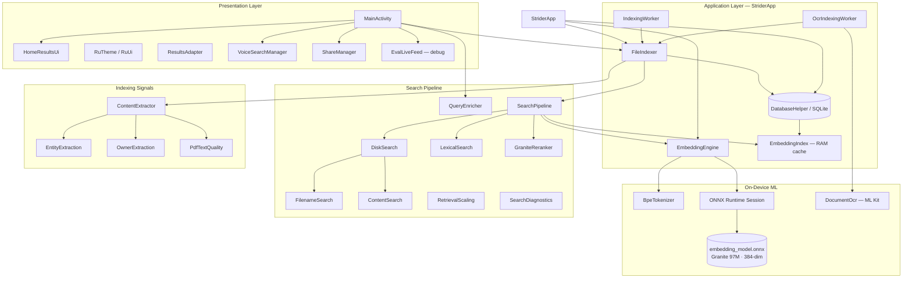
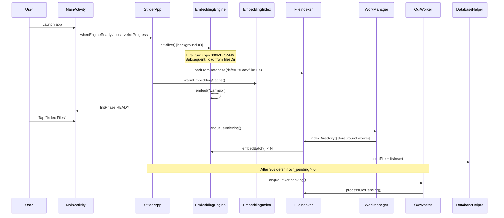
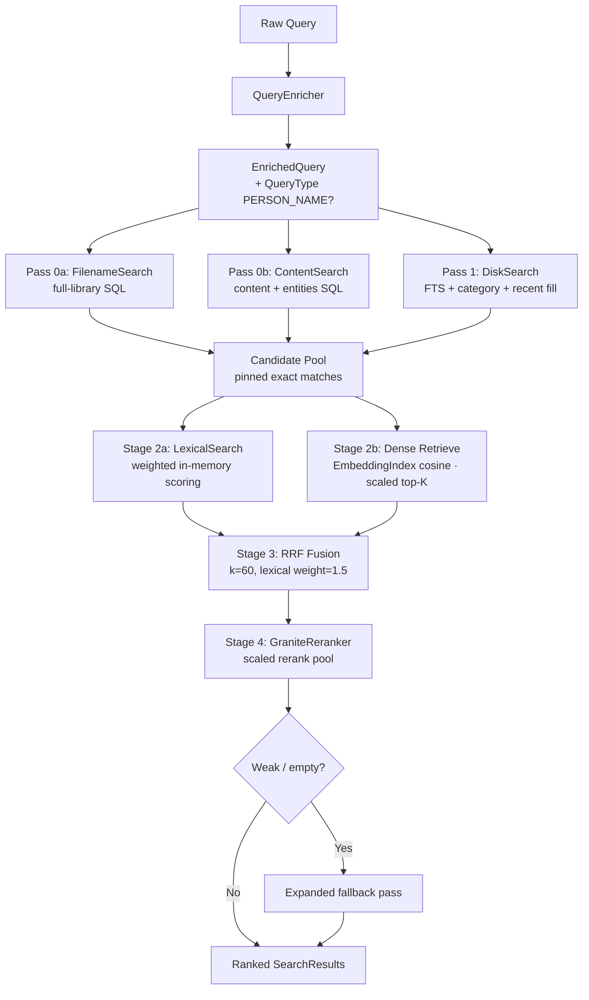
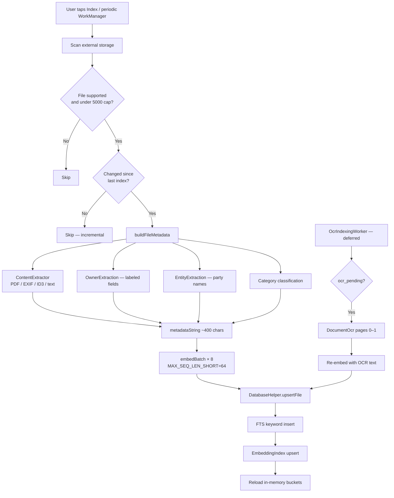

# RU (Strider Quanto)

**On-device, multilingual semantic search for files on Android.**

RU finds documents, photos, and media on your phone using natural language — in Hindi, English, Hinglish, and many other languages — without sending your files or queries to the cloud. All indexing, embedding, OCR, and ranking runs locally via ONNX Runtime, ML Kit, and SQLite.

| | |
|---|---|
| **Platform** | Android 8.0+ (API 26), target SDK 34 |
| **Language** | Kotlin 1.9.22 |
| **Build system** | Gradle 8.13 / Android Gradle Plugin 8.13 |
| **Embedding model** | IBM Granite Embedding 97M Multilingual (`granite-embedding-97m-multilingual-r2`) |
| **Inference** | ONNX Runtime Android 1.17.3 |
| **OCR** | ML Kit Text Recognition (Latin + Devanagari) |
| **Storage** | SQLite + FTS5 (with FTS4 fallback) |
| **Background work** | WorkManager 2.9 (indexing + OCR workers) |
| **Privacy** | 100% on-device search/index; no analytics SDK in release builds |

---

## Table of Contents

1. [Overview](#overview)
2. [What's New](#whats-new)
3. [Features](#features)
4. [App Screens & UX](#app-screens--ux)
5. [Architecture](#architecture)
6. [Search Pipeline](#search-pipeline)
7. [Large-Library Retrieval](#large-library-retrieval)
8. [Indexing Pipeline](#indexing-pipeline)
9. [OCR Pipeline](#ocr-pipeline)
10. [Entity & Person-Name Search](#entity--person-name-search)
11. [Embedding Model](#embedding-model)
12. [Data Model](#data-model)
13. [Eval & Analytics Logging](#eval--analytics-logging)
14. [Debug Tooling](#debug-tooling)
15. [Project Structure](#project-structure)
16. [Getting Started](#getting-started)
17. [Configuration](#configuration)
18. [Performance Benchmarks](#performance-benchmarks)
19. [Testing](#testing)
20. [Privacy & Permissions](#privacy--permissions)
21. [Supported File Types](#supported-file-types)
22. [Troubleshooting](#troubleshooting)
23. [Limitations & Roadmap](#limitations--roadmap)
24. [Engineering Notes](#engineering-notes)

---

## Overview

Most file managers search by filename. RU goes further:

- **Semantic search** — query *"budget spreadsheet from last quarter"* and find `Q3_finance.xlsx` even when the filename says nothing about budgets.
- **Lexical search** — fast keyword matching on filenames, folder paths, extracted content snippets, entities, and metadata.
- **Hybrid retrieval** — multiple retrieval passes (filename SQL, content SQL, FTS, category, dense scan) fused with Reciprocal Rank Fusion (RRF), then reranked with a Granite bi-encoder + metadata overlap stage (production RAG pattern).
- **Multilingual queries** — conversational Hindi/English/Hinglish and cross-script token bridging.
- **Personal search** — *"mera Aadhaar"*, *"Ram Kumar's PAN"* using on-device name extraction from filenames and document content.
- **Person-name search** — find party names inside PDF bodies (e.g. *"Tanuj"*, *"Nikharv"* in an NDA) via entity extraction and content token SQL, not just semantic similarity.
- **Filename-first search** — queries like *"nda quantoo"* match filenames across the full library, bypassing FTS candidate caps.
- **Live search** — typing and keyboard Search use the **same hybrid pipeline**; results update as you type (debounced).
- **Voice search** — speak a query via Android's speech recognizer (requires network for Google's STT on most devices).
- **Share intents** — *"share my invoice on WhatsApp"* opens a file picker and routes to the target app.
- **Scanned PDF OCR** — background ML Kit OCR for weak-text PDFs (Latin + Devanagari fallback).
- **Large library support** — tuned for 20k–24k+ files with scaled retrieval pools, RAM embedding cache, and tiered exact-match passes.

The app is designed for mid-range ARM devices (e.g. Snapdragon 439 class) with careful attention to thermal load, battery, and background indexing via WorkManager.

---

## What's New

This section summarizes major changes since the initial RU prototype. See [`Tasks.md`](Tasks.md) for the full engineering handoff and QA test matrix.

### Search & Retrieval

| Change | Module(s) | Description |
|--------|-----------|-------------|
| **Unified typing + Search** | `MainActivity.performSearch()` | Live typing and IME Search both call the same hybrid pipeline with semantic enabled (no more lexical-only preview mode). |
| **Tiered disk retrieval** | `DiskSearch`, `FilenameSearch`, `ContentSearch` | Full-library SQL passes for filename and content/entity tokens before FTS caps apply. |
| **Large-library scaling** | `RetrievalScaling`, `EmbeddingIndex` | Dense top-K scales to ~350 at 24k files; ~37 MB RAM embedding matrix avoids re-reading SQLite blobs every search. |
| **Recall fallback pass** | `SearchPipeline` | Expanded candidate pool when primary pass returns weak/empty results. |
| **Person-name query routing** | `QueryEnricher`, `QueryType.PERSON_NAME` | 1–2 token name-like queries get lexical/entity boosts in `LexicalSearch` and `GraniteReranker`. |
| **Entity extraction** | `EntityExtraction.kt` | Party/person names from NDA body text ("between X and Y", signatures, email local-parts). |
| **Centralized weights** | `SearchWeights.kt` | Single source of truth for RRF, lexical, reranker, and fallback constants. |
| **Golden query eval** | `SearchEval.kt` | Dev-mode pass/fail checks for `nda quantoo`, `Tanuj`, `Nikharv` test cases. |

### Indexing & OCR

| Change | Module(s) | Description |
|--------|-----------|-------------|
| **DB schema v4** | `DatabaseHelper` | New `entities` column for extracted party/person tokens. |
| **DB schema v5** | `DatabaseHelper` | New `ocr_pending` flag; weak PDFs queued for background OCR. |
| **OCR worker** | `OcrIndexingWorker`, `DocumentOcr` | ML Kit Latin + Devanagari OCR on scanned PDF pages 0–1; deferred 90s after cold start. |
| **PDF quality heuristics** | `PdfTextQuality.kt` | Detects weak text, OCR eligibility, skips DCIM/Camera photo folders. |
| **Embedding RAM cache warm** | `EmbeddingIndex`, `StriderApp` | Loads all embeddings into memory on startup for fast dense scan. |
| **Deferred FTS backfill** | `FileIndexer`, `StriderApp` | Search ready before FTS keyword backfill completes. |

### UI & Shell

| Change | Module(s) | Description |
|--------|-----------|-------------|
| **Four-tab navigation** | `MainActivity`, `Screen` enum | Home · Index · Analytics (debug) · Settings. |
| **Redesigned app shell** | `RuUi`, `RuTheme`, layouts | Fraunces/Hanken Grotesk typography, warm palette, dark mode toggle. |
| **Results sheet UX** | `HomeResultsUi`, `SkeletonResultsAdapter` | Draggable bottom sheet, skeleton loading, nav bar hides during results. |
| **Index progress dial** | `IndexProgressDialView` | Custom circular progress with category bucket chips. |
| **Onboarding overlay** | `dialog_onboarding_name.xml` | Optional name capture on first run with confirmation toast. |
| **Analytics screen** | `EvalLiveFeed`, `AnalyticsEventAdapter` | Live event feed in debug builds (`EVAL_LOGGING=true`). |

### Developer Tooling

| Change | Module(s) | Description |
|--------|-----------|-------------|
| **Eval logging** | `eval/EvalLogger`, `EvalFileSink` | NDJSON events to `filesDir/ru_eval/` (search, index, init, clicks). |
| **Search diagnostics** | `SearchDiagnostics`, `TargetFileReport` | Per-stage rank tracking; tap status line for full report. |
| **Unit tests** | `app/src/test/` | QueryEnricher, QueryScoring, MultilingualBridge, PdfTextQuality. |

---

## Features

### Search

| Feature | Description |
|---------|-------------|
| **Hybrid retrieval** | Filename SQL + content SQL + FTS + category + dense scan → RRF fusion → Granite rerank |
| **Live unified pipeline** | Same hybrid search while typing (debounced) and on keyboard Search |
| **Query enrichment** | Strips filler words, expands synonyms, detects category/time/type/owner/person-name intent |
| **Category hints** | Identity, Work, Education, Personal, Media buckets boost relevant files |
| **Time hints** | *"recent"*, *"this week"*, *"last year"* map to age buckets |
| **Owner matching** | Filename + content name extraction; user profile for possessive queries |
| **Person-name routing** | Name-like 1–2 token queries prioritize entity/content matches over weak semantic rank |
| **Filename pinning** | Full-library filename SQL hits never dropped by candidate pool caps |
| **Content pinning** | Full-library content/entity SQL hits pinned like filename hits |
| **Recall fallback** | Expanded retrieval pass when primary results are weak or empty |
| **Semantic toggle** | Disable AI matching in Settings for lexical-only mode |
| **Category filter chips** | Refine live results by category bucket from Home |

### Indexing

| Feature | Description |
|---------|-------------|
| **Background indexing** | WorkManager foreground service survives app close and Doze |
| **Incremental updates** | Skips unchanged files (mtime + size hash); periodic 24h re-scan |
| **Priority directories** | Documents, Downloads, DCIM, WhatsApp, etc. indexed first |
| **Batched inference** | 8 files per ONNX forward pass |
| **Content extraction** | PDF text, image EXIF, audio ID3 tags, archive listing, plain text |
| **Entity extraction** | Party/person names from PDF body text for keyword + FTS indexing |
| **FTS keyword index** | SQLite FTS5 for auxiliary keyword storage and backfill |
| **OCR backfill** | Background worker OCRs weak-text PDFs after primary index completes |
| **Embedding cache** | In-memory matrix warmed on startup for fast search at scale |

### UX

| Feature | Description |
|---------|-------------|
| **One-time model setup** | ~390 MB model copied to `filesDir` on first install; warm session thereafter |
| **Non-blocking first run** | Browse Settings/onboarding while model loads in background |
| **Onboarding** | Optional name capture for personalized *"my document"* searches |
| **Four screens** | Home (search), Index (progress), Analytics (debug), Settings |
| **Dark mode** | Light/dark theme toggle persisted in SharedPreferences |
| **Notifications** | Live indexing and OCR progress with tap-to-open |
| **Share picker** | Multi-match share flow with Next/Cancel when query matches several files |

---

## App Screens & UX

### Navigation

Bottom tab bar with four destinations (Analytics hidden in release builds):

```text
Home  ·  Index  ·  Analytics (debug)  ·  Settings
```

The tab bar **hides automatically** when the Home results sheet is expanded. Last-selected tab persists across process death via `SharedPreferences`.

### Home

- Bilingual tagline cycle (Hindi/English).
- Search bar with live hybrid results, voice mic, and clear button.
- Draggable results bottom sheet (`HomeResultsUi`) with skeleton placeholders during search.
- Category bucket filter chips for refining results.
- Debug target field (dev mode) for tracking a specific file through retrieval stages.

### Index

- Custom circular progress dial (`IndexProgressDialView`).
- Live file count and phase status (idle → scanning → done).
- Category bucket chips showing indexed file distribution.
- Index / Re-index buttons; incremental scan by default, force-full available.

### Settings

| Section | Options |
|---------|---------|
| **Search** | Semantic search, voice search, multilingual bridging |
| **Indexing** | Read file content (PDF + OCR), auto re-index (24h), max files (5,000) |
| **About** | Model name, setup status, app version |
| **Actions** | Clear index, dark/light theme toggle |

### Analytics (debug builds only)

When `BuildConfig.EVAL_LOGGING = true` (debug builds):

- Live system status (index count, cache warm state).
- Last search query summary.
- Scrolling event feed (`EvalLiveFeed`) of search/index/init events.
- Events also written to `filesDir/ru_eval/events/*.jsonl` for offline analysis.

### Onboarding

First-run overlay captures optional display name for possessive query matching (*"my Aadhaar"*). Stored locally in `SharedPreferences` only. User can dismiss and set name later in Settings.

### Design System

| Token | Resource | Usage |
|-------|----------|-------|
| Canvas | `@color/ru_bg` | Warm cream background |
| Accent | `@color/ru_crimson` | Active nav, progress, CTAs |
| Display font | Fraunces SemiBold | Wordmarks, page titles |
| UI font | Hanken Grotesk | Body, labels, settings rows |
| Hindi font | Tiro Devanagari Hindi | Hindi taglines and hints |
| Category colors | `cat_identity`, `cat_work`, etc. | Bucket chips on Index and Home |

Design handoff reference: [`latest/design_handoff_ru_app_shell/README.md`](latest/design_handoff_ru_app_shell/README.md)

---

## Architecture

### High-Level System Diagram



### Application Lifecycle

The ONNX session is owned by `StriderApp` (not `MainActivity`) so it survives activity recreation, app switching, and screen-off. The model is copied once to `filesDir` (not `cacheDir`, which Android may clear).



### Module Responsibilities

| Module | Role |
|--------|------|
| `StriderApp` | Process-scoped engine, indexer, DB; init progress; WorkManager + OCR scheduling; embedding cache warm |
| `MainActivity` | Four-screen shell, unified search, voice, share, onboarding, analytics (debug) |
| `HomeResultsUi` | Results sheet layout, skeleton loading, nav hide/show, sheet drag |
| `RuTheme` / `RuUi` | Dark mode, wordmark typography, shared UI helpers |
| `EmbeddingEngine` | ONNX session lifecycle, BPE tokenization, single + batch embed, cosine similarity |
| `EmbeddingIndex` | In-memory embedding matrix for full-library dense scan (~37 MB @ 24k) |
| `BpeTokenizer` | Parses `tokenizer.json`; Granite special tokens (`<|startoftext|>`, `<|return|>`) |
| `FileIndexer` | Storage walk, metadata build, batched embedding, OCR processing, in-memory category buckets |
| `DatabaseHelper` | SQLite persistence, embedding blobs, FTS5/FTS4, filename/content SQL search |
| `IndexingWorker` | WorkManager coroutine worker with foreground notification |
| `OcrIndexingWorker` | Background OCR for weak-text PDFs with battery-not-low constraint |
| `DocumentOcr` | ML Kit Latin + Devanagari OCR on rendered PDF pages |
| `PdfTextQuality` | Weak-text detection, OCR eligibility heuristics |
| `SearchPipeline` | Orchestrates tiered retrieval → lexical → dense → RRF → rerank → fallback |
| `DiskSearch` | FTS + category + recent fill candidate gathering with scaled caps |
| `FilenameSearch` | Full-library filename token SQL pass |
| `ContentSearch` | Full-library content/entity token SQL pass |
| `RetrievalScaling` | Library-size-aware limits for dense top-K, FTS, rerank pool, SQL passes |
| `QueryEnricher` | Query parsing, synonym expansion, owner intent, person-name detection |
| `LexicalSearch` | In-memory weighted token scoring on candidate stubs |
| `GraniteReranker` | Second-stage bi-encoder + metadata overlap scoring |
| `SearchWeights` | Centralized tunable constants for all scoring stages |
| `SearchDiagnostics` | Target file rank tracking through retrieval stages |
| `SearchEval` | Golden query pass/fail evaluation (dev mode) |
| `EntityExtraction` | Party/person name extraction from unstructured PDF text |
| `ContentExtractor` | PDF, EXIF, ID3, ZIP listing, text signal extraction |
| `MultilingualBridge` | Cross-script tokens, stop words, language hints |
| `OwnerExtraction` / `OwnerMatcher` | Name entities from labeled ID fields and filenames |
| `UserProfile` | On-device display name for possessive queries |
| `TokenPathFilter` | Post-SQL path filtering for filename/content token matches |
| `VoiceSearchManager` | Speech-to-text search |
| `ShareManager` | Intent-based file sharing with multi-match picker |
| `ResultsAdapter` / `SkeletonResultsAdapter` | Search results and loading placeholders |
| `IndexProgressDialView` | Custom circular index progress indicator |
| `eval/EvalLogger` | Fire-and-forget NDJSON event logging (debug builds) |
| `eval/EvalLiveFeed` | In-app analytics dashboard state |
| `AppInitState` | Init progress phases for UI banner |

---

## Search Pipeline

RU implements a **tiered hybrid retrieval pipeline** aligned with BEIR/RAG production patterns: retrieve broadly from multiple exact and semantic signals, fuse rankings, rerank top candidates, and fall back to an expanded pass when recall is weak.



### Stage 0 — Exact-Match SQL Passes

Before FTS caps apply, two full-library SQL passes run:

**FilenameSearch** — `DatabaseHelper.searchPathsByNameTokens()` matches query tokens against `name` and `path` columns. Critical for queries like *"nda quantoo"* where semantic rank may be ~6000 but filename match is exact.

**ContentSearch** — `DatabaseHelper.searchPathsByContentTokens()` matches against `content_snip`, `metadata_str`, and `entities`. Critical for person-name queries like *"Tanuj"* where dense rank may be ~1500 but entity/content match is exact.

Both passes use `RetrievalScaling.tokenSqlSearchLimit()` (scales with library size, floor 80) and `TokenPathFilter` for post-filtering. Results are **pinned** — never dropped when the general candidate pool is capped.

### Stage 1 — Disk-Backed Candidate Retrieval (`DiskSearch`)

Builds the candidate pool from:

1. Filename SQL hits (pinned)
2. Content/entity SQL hits (pinned)
3. FTS5 keyword search (scaled limit: 600–2500)
4. Category-filtered paths when category hints detected
5. Recent files fill (reduced at scale to avoid recency bias drowning specific queries)

Pool cap scales with library size: ~1,800–4,000 paths (primary), ~2,500–5,000 (expanded fallback).

### Stage 2a — Lexical Search

`LexicalSearch` scores candidate file stubs in memory using weighted token overlap (constants in `SearchWeights`):

| Signal | Weight (approx.) |
|--------|------------------|
| Filename exact match | 100 |
| Filename prefix/suffix | 80 |
| Filename contains | 50 |
| Entity field match | 55 |
| Content snippet match | 35 |
| Extension match | 40 |
| Folder name | 15 |
| Metadata string | 8 |
| Person-name full match | +120 |
| Person-name partial | +40 per hit |

Boosts: category match (×1.12), time bucket (×1.08), media type filter (×1.8), owner multiplier for possessive queries.

### Stage 2b — Dense Retrieval

When semantic search is enabled:

1. Embed the cleaned query (`FIXED_SEQ_LEN = 128`).
2. **Full-library dense scan** via `EmbeddingIndex` RAM cache (or SQLite blob fallback if cache cold).
3. Keep top-K by cosine similarity — **scaled with library size**:

| Library size | Dense top-K |
|--------------|-------------|
| ≤ 2,000 | 50 |
| ≤ 5,000 | 80 |
| ≤ 10,000 | 120 |
| ≤ 20,000 | 200 |
| 24,000+ | ~350 |

4. Lexical top hits pinned into dense results when missing from top-K.

### Stage 3 — Reciprocal Rank Fusion

```text
RRF_score(path) = 1.5 / (60 + lexical_rank) + 1.0 / (60 + dense_rank)
```

Lexical hits receive 1.5× weight (`SearchWeights.LEXICAL_RRF_WEIGHT`) because filename matches are often decisive. Filename, content, and strong lexical hits are pinned into the rerank pool regardless of RRF rank.

### Stage 4 — Granite Reranker

`GraniteReranker` approximates cross-encoder interaction using:

- Granite bi-encoder cosine similarity (query vs file embedding)
- Normalized lexical score with **adaptive weights** based on query type:
  - Person-name queries: 78% lexical / 22% dense
  - Period queries (Q1, 2024): 72% lexical / 28% dense
  - Strong filename match: 55% lexical / 45% dense
  - Weak lexical: 10% lexical / 90% dense
- Token overlap on metadata string, content snippet, entities, and filename
- Filename coverage boost (+80 per token, +100 full match bonus)
- Specificity multiplier, language hint multiplier, category/time/owner boosts

Final score is clamped to `[0, 1]` and displayed as a percentage in the UI.

### Stage 5 — Recall Fallback

If the primary pass returns empty results, top score < 0.22, weak lexical (< 12), or weak dense (< 0.38), `SearchPipeline` re-runs with `expanded = true`:

- Wider FTS limit (~1200 vs 600)
- Larger candidate pool cap (~5000 vs 4000)
- Same reranking logic

### Unified Live Search

Both typing (debounced ~500–700ms via `TextWatcher`) and keyboard Search call `performSearchWithFilter()` with `semanticEnabled = isSemanticEnabled()`. The `searchGeneration` counter prevents stale results from overwriting newer queries.

Search triggers logged to eval: `live_refine`, `ime_search`, `voice`, `category_filter`.

### Query Enrichment Examples

| Raw query | Clean embed query | Detected signals |
|-----------|-------------------|------------------|
| *"find my aadhaar card please"* | `aadhaar card` | Owner: SELF, Category: IDENTITY |
| *"Q2 budget report"* | `q2 budget report` | Period: Q2, Category: WORK |
| *"python notes in hindi"* | `python notes hindi` | Language: HINDI, Category: EDUCATION |
| *"share invoice on whatsapp"* | `invoice` | Action: share, Target: whatsapp |
| *"Tanuj"* | `tanuj` | QueryType: PERSON_NAME |
| *"nda quantoo"* | `nda quantoo` | Filename-driven (GENERAL) |

---

## Large-Library Retrieval

At ~24,000 files, fixed retrieval caps drop 99.7% of the index before reranking. RU addresses this with:

### RetrievalScaling

All pool sizes, limits, and pin counts scale with `DatabaseHelper.getTotalCount()`:

| Parameter | At 24k files (approx.) |
|-----------|------------------------|
| Dense top-K | 350 |
| RRF fusion width | 96 |
| Rerank pool cap | 180 |
| FTS limit (normal) | ~2,200 |
| Max candidate paths | ~3,000 |
| Token SQL search limit | 120 |
| Exact match pin limit | 60 |

### EmbeddingIndex RAM Cache

```text
24,000 files × 384 dims × 4 bytes ≈ 37 MB
```

Loaded once on startup via `DatabaseHelper.warmEmbeddingCache()`. Enables full-library dense scan without re-reading SQLite BLOBs per search. State machine: `COLD → LOADING → WARM`. Upserted on incremental index.

### Why Not Just Raise top-K?

At 24k files, many files cluster at cosine ~0.45–0.55. Raising dense top-K to 6000+ is slow and still misses filename/content matches. The fix is **tiered exact passes** (filename, content, entities) that bypass semantic rank entirely, plus reranker tuning — not brute-force dense recall.

---

## Indexing Pipeline



### Priority Scan Order

Files under these paths are indexed first so useful results appear within ~30 seconds of starting:

```text
Documents → Download(s) → DCIM → Camera → WhatsApp → Media → Pictures → Music → Movies → rest
```

### Incremental Indexing

Each file record stores `last_modified` and `size_bytes`. On re-index:

- **Unchanged files** — skipped entirely (no re-embedding).
- **New/changed files** — re-embedded and upserted.
- **Deleted files** — removed from DB when absent from disk scan.

Periodic WorkManager job runs every 24 hours (battery-not-low constraint) for incremental updates.

### Metadata String Composition

Each file's embedding input is a rich text string built from:

- Normalized filename and extension
- Parent folder name
- Category labels and type label
- Content snippet (up to ~800 chars from PDF/text; entity tokens stripped from embed budget)
- Owner name tokens (labeled ID fields)
- Extracted entities (party/person names — stored separately, searched via SQL)
- Filename entities (dates, quarters, document numbers)
- PDF metadata (title, author)
- Multilingual keyword extras

Capped at ~400 characters / 96 tokens for embedding. Entity names are indexed for keyword search but stripped from the embed string to keep semantic vectors thematic.

### Dual-Channel Index

| Channel | Storage | Search path |
|---------|---------|-------------|
| **Semantic** | `embedding` BLOB (384-dim) | Dense cosine via `EmbeddingIndex` |
| **Keyword** | `content_snip`, `entities`, FTS `keywords` | Content SQL + FTS + lexical |
| **Filename** | `name`, `path` | Filename SQL + lexical |

---

## OCR Pipeline

Scanned PDFs often have no extractable text layer. RU detects weak text during indexing and queues files for background OCR.

### Detection (`PdfTextQuality`)

A PDF is flagged `ocr_pending = 1` when:

- Not encrypted, ≤ 50 MB, ≤ 150 pages
- Extracted text has < 40 alphanumeric chars or < 8 words
- Not stored under DCIM/Camera/Pictures (photo-folder heuristic)

DB upgrade v5 automatically flags existing weak PDFs for OCR.

### Processing (`OcrIndexingWorker`)

- Runs as a separate WorkManager job with `ExistingWorkPolicy.KEEP`
- Deferred **90 seconds** after cold start (avoids competing with model init for CPU/thermal)
- Requires battery-not-low
- Renders PDF pages at ~108 DPI (scale 1.5, max 1600px dimension)
- OCR page 0 always; page 1 if page 0 text is weak
- Latin recognizer first; Devanagari fallback if Latin text is weak
- Max 4,000 OCR chars stored; file re-embedded and FTS updated
- Chains itself if more pending files remain (5s defer between chains)

### Dependencies

```gradle
implementation 'com.google.mlkit:text-recognition:16.0.1'
implementation 'com.google.mlkit:text-recognition-devanagari:16.0.0'
```

OCR runs entirely on-device via ML Kit. No cloud OCR.

---

## Entity & Person-Name Search

### Problem

Person names in PDF body text (e.g. party names in NDAs) were invisible to search because:

1. `OwnerExtraction` only matched labeled fields (`Name:`, `S/o`, etc.)
2. Content was truncated to 800 chars / 60 distinct words
3. Embedding budget (400 chars) diluted name signal among generic metadata
4. No content keyword SQL pass existed (unlike filename pass)

### Solution

**EntityExtraction** parses unstructured PDF text for:

- *"between X and Y"* patterns
- *"Party A/B:"* labels
- *"signed by X"* / signature blocks
- Email local-parts (`tanuj@company.com`)
- *"(Name) hereinafter"* clauses

Entities stored in `entities` column (comma-separated, lowercase) and included in FTS keywords.

**QueryType.PERSON_NAME** detected when query is 1–2 name-like tokens without document-type words (*"certificate"*, *"invoice"*, etc.).

**LexicalSearch** adds +120 for full entity match, +40 per partial hit.

**GraniteReranker** shifts to 78% lexical / 22% dense weighting for person-name queries.

### Acceptance Criteria (from Tasks.md)

| Query | Expected file | Target rank |
|-------|---------------|-------------|
| `nda quantoo` | `NDA- Quantoo .pdf` | #1 (filename) |
| `Tanuj` | `NDA- Quantoo .pdf` | Top 3 (entity/content) |
| `Nikharv` | `NDA- Quantoo .pdf` | Top 3 (entity/content) |

---

## Embedding Model

| Property | Value |
|----------|-------|
| **Model** | IBM Granite Embedding 97M Multilingual R2 |
| **Architecture** | ModernBERT (`ModernBertModel`) |
| **Hidden size** | 384 |
| **Layers / heads** | 12 / 12 |
| **Vocab size** | 180,000 (BPE) |
| **Output** | Mean-pooled, L2-normalized 384-dim vector |
| **ONNX asset** | `app/src/main/assets/embedding_model.onnx` (~390 MB) |
| **Tokenizer** | `tokenizer.json` + `tokenizer_config.json` |

### Inference Parameters

| Parameter | Indexing | Search query |
|-----------|----------|--------------|
| Sequence length | 64 (`MAX_SEQ_LEN_SHORT`) | 128 (`FIXED_SEQ_LEN`) |
| Batch size | 8 | 1 |
| ONNX threads | 2 intra-op, 1 inter-op | same |
| Optimization | `BASIC_OPT` | same |
| Batch cooldown | 40 ms between batches | — |

### Pooling & Similarity

Token embeddings are **mean-pooled** over non-padding positions (attention mask = 1), then **L2-normalized**. Cosine similarity reduces to a dot product on normalized vectors.

---

## Data Model

### SQLite Schema (`ru_index.db`, version 5)

**Table: `indexed_files`**

| Column | Type | Description |
|--------|------|-------------|
| `path` | TEXT UNIQUE | Absolute file path |
| `name` | TEXT | Filename |
| `extension` | TEXT | Lowercase extension |
| `size_bytes` | INTEGER | File size |
| `last_modified` | INTEGER | mtime for incremental indexing |
| `categories` | TEXT | Comma-separated category labels |
| `age_bucket` | TEXT | today / this-week / this-month / … |
| `size_bucket` | TEXT | tiny / small / medium / large / huge |
| `type_label` | TEXT | Human-readable type (e.g. "pdf document") |
| `content_snip` | TEXT | Extracted text snippet |
| `metadata_str` | TEXT | Full metadata string used for embedding |
| `embedding` | BLOB | 384 × float32 = 1,536 bytes |
| `indexed_at` | INTEGER | Index timestamp |
| `owner_names` | TEXT | Extracted owner tokens (labeled ID fields) |
| `owner_confidence` | REAL | Owner extraction confidence |
| `entities` | TEXT | Party/person names from body text (v4+) |
| `ocr_pending` | INTEGER | 1 = queued for background OCR (v5+) |

**Virtual table: `fts_index` (FTS5 preferred, FTS4 fallback)**

| Column | Description |
|--------|-------------|
| `path` | UNINDEXED — links to main table |
| `keywords` | Searchable keyword string for auxiliary FTS |

### Schema Migration History

| Version | Change |
|---------|--------|
| v1 | Initial table |
| v2 | FTS5/FTS4 virtual table; force re-index |
| v3 | `owner_names`, `owner_confidence`; force re-index |
| v4 | `entities` column; force re-index |
| v5 | `ocr_pending`; flag weak PDFs for OCR |

### In-Memory Category Buckets

`FileIndexer` maintains six buckets for fast category-filtered retrieval:

```text
IDENTITY · WORK · EDUCATION · PERSONAL · MEDIA · GENERAL
```

A file may belong to multiple categories simultaneously.

### EmbeddingIndex (RAM)

Not persisted — rebuilt from SQLite on startup:

```text
paths: Array<String>           — row index lookup
matrix: FloatArray             — flat row-major [N × 384]
pathToRow: HashMap<String, Int>
state: COLD | LOADING | WARM
```

---

## Eval & Analytics Logging

Debug builds (`BuildConfig.EVAL_LOGGING = true`) write structured NDJSON events to on-device storage. Release builds compile with `EVAL_LOGGING = false` — zero overhead, Analytics tab hidden.

### Event Types

| Event | File | Key fields |
|-------|------|------------|
| `search_completed` | `events/search_YYYY-MM-DD.jsonl` | query, retrieval metrics, results, timing, debug_target, golden_eval |
| `index_completed` | `events/index_YYYY-MM-DD.jsonl` | indexed/skipped/deleted counts, duration, category breakdown |
| `index_worker` | `events/index_YYYY-MM-DD.jsonl` | status, wait_for_model_ms, error |
| `init_phase` | `events/init_YYYY-MM-DD.jsonl` | phase, progress, duration_ms, first_model_load |
| `result_clicked` | `events/search_YYYY-MM-DD.jsonl` | query, clicked_rank, top1_path |

Schema reference: [`eval_logging/README.schema.json`](eval_logging/README.schema.json)

### Exporting Analytics Data

```bash
adb pull /data/data/com.strider.quanto/files/ru_eval ./analytics_data
```

### In-App Analytics Screen

The Analytics tab (debug only) shows:

- System status: index count, embedding cache warm/cold
- Last search query and top result
- Live scrolling event feed via `EvalLiveFeed`

---

## Debug Tooling

Available when hybrid dev mode is enabled in `MainActivity`:

### Target File Tracking

- **Debug target field** on Home screen — enter expected filename substring (e.g. `invoice.pdf`)
- **Status line summary** — shows dense rank, lexical rank, shown rank, pool status
- **Tap status** — full multi-line report dialog
- **Logcat tag** `SearchDebug` — detailed verdict lines

Example status line:

```text
Track "quantoo" → NDA- Quantoo .pdf · dense #6272 (cutoff top 350) · lexical #1 · #1 · pool ✓
```

### Result Badges

Search result rows show debug badges in dev mode: `d#N l#N` (dense rank, lexical rank).

### Golden Query Evaluation

`SearchEval.GOLDEN_CASES` automatically evaluates known queries and logs PASS/FAIL to logcat when query matches a golden case.

### SearchWeights Tuning

All retrieval constants live in `SearchWeights.kt`. Change values only after golden-query eval to avoid regressions.

---

## Project Structure

```text
StriderQuanto/
├── app/
│   ├── build.gradle                     # Dependencies, EVAL_LOGGING flag, noCompress onnx
│   └── src/
│       ├── main/
│       │   ├── AndroidManifest.xml
│       │   ├── assets/
│       │   │   ├── embedding_model.onnx # ~390 MB — not in git by default
│       │   │   ├── tokenizer.json
│       │   │   └── tokenizer_config.json
│       │   ├── kotlin/com/strider/quanto/
│       │   │   ├── StriderApp.kt            # Application lifecycle, workers, cache warm
│       │   │   ├── MainActivity.kt          # Four-screen shell, unified search
│       │   │   ├── HomeResultsUi.kt         # Results sheet UX
│       │   │   ├── RuTheme.kt / RuUi.kt     # Dark mode, typography
│       │   │   ├── EmbeddingEngine.kt       # ONNX inference
│       │   │   ├── EmbeddingIndex.kt        # RAM embedding matrix
│       │   │   ├── BpeTokenizer.kt          # BPE encoding
│       │   │   ├── FileIndexer.kt           # Indexing + search entry + OCR processing
│       │   │   ├── DatabaseHelper.kt        # SQLite persistence (v5)
│       │   │   ├── IndexingWorker.kt        # WorkManager background job
│       │   │   ├── OcrIndexingWorker.kt     # Background OCR worker
│       │   │   ├── DocumentOcr.kt           # ML Kit PDF OCR
│       │   │   ├── PdfTextQuality.kt        # Weak-text / OCR eligibility
│       │   │   ├── SearchPipeline.kt        # Tiered hybrid retrieval
│       │   │   ├── DiskSearch.kt            # FTS + category candidate gathering
│       │   │   ├── FilenameSearch.kt        # Full-library filename SQL
│       │   │   ├── ContentSearch.kt         # Full-library content/entity SQL
│       │   │   ├── RetrievalScaling.kt      # Library-size-aware limits
│       │   │   ├── LexicalSearch.kt         # In-memory lexical scoring
│       │   │   ├── GraniteReranker.kt       # Second-stage reranker
│       │   │   ├── SearchWeights.kt         # Centralized scoring constants
│       │   │   ├── SearchDiagnostics.kt     # Target file rank tracking
│       │   │   ├── SearchEval.kt            # Golden query evaluation
│       │   │   ├── QueryEnricher.kt         # Query parsing & enrichment
│       │   │   ├── QueryScoring.kt          # Specificity / filename helpers
│       │   │   ├── MultilingualBridge.kt    # Cross-language token bridge
│       │   │   ├── EntityExtraction.kt      # Party/person name extraction
│       │   │   ├── ContentExtractor.kt      # PDF, EXIF, ID3, text signals
│       │   │   ├── FileMetadata.kt          # Categories, buckets, metadata build
│       │   │   ├── OwnerExtraction.kt       # Labeled ID field extraction
│       │   │   ├── OwnerMatcher.kt          # Owner intent scoring
│       │   │   ├── TokenPathFilter.kt       # Post-SQL path filtering
│       │   │   ├── UserProfile.kt           # On-device user name
│       │   │   ├── VoiceSearchManager.kt    # Speech-to-text search
│       │   │   ├── ShareManager.kt          # Intent-based file sharing
│       │   │   ├── ResultsAdapter.kt        # Search results RecyclerView
│       │   │   ├── SkeletonResultsAdapter.kt# Loading skeleton rows
│       │   │   ├── AppInitState.kt          # Init progress phases
│       │   │   ├── ui/
│       │   │   │   └── IndexProgressDialView.kt  # Circular index progress
│       │   │   └── eval/
│       │   │       ├── EvalLogger.kt        # NDJSON event dispatch
│       │   │       ├── EvalFileSink.kt        # File I/O for events
│       │   │       ├── EvalEvent.kt           # Event serialization
│       │   │       ├── EvalSession.kt         # Session metadata
│       │   │       ├── EvalLiveFeed.kt        # Analytics dashboard state
│       │   │       └── AnalyticsEventAdapter.kt
│       │   └── res/                         # Layouts, drawables, fonts, strings
│       └── test/kotlin/com/strider/quanto/
│           ├── QueryEnricherTest.kt
│           ├── QueryScoringTest.kt
│           ├── MultilingualBridgeTest.kt
│           └── PdfTextQualityTest.kt
├── model_assets/                        # Source model files (copy to assets/)
│   ├── config.json
│   ├── onnx/model.onnx
│   ├── tokenizer.json
│   ├── tokenizer_config.json
│   └── special_tokens_map.json
├── eval_logging/
│   └── README.schema.json             # Analytics event schema
├── latest/
│   └── design_handoff_ru_app_shell/   # UI design handoff + screenshots
├── build.gradle                       # AGP 8.13.2, Kotlin 1.9.22
├── settings.gradle
├── Tasks.md                           # Engineering handoff & QA test matrix
└── README.md                          # This file
```

---

## Getting Started

### Prerequisites

- **Android Studio** Hedgehog (2023.1.1) or newer
- **JDK 17**
- **Android device or emulator** — API 26+; physical device recommended for storage indexing
- **~500 MB free storage** on device for model + index

### 1. Place Model Assets

The ONNX model is not committed to git (size). Copy from `model_assets/` into the app assets folder:

**Windows (PowerShell):**

```powershell
Copy-Item "model_assets\onnx\model.onnx" "app\src\main\assets\embedding_model.onnx"
Copy-Item "model_assets\tokenizer.json" "app\src\main\assets\tokenizer.json"
Copy-Item "model_assets\tokenizer_config.json" "app\src\main\assets\tokenizer_config.json"
```

**macOS / Linux:**

```bash
cp model_assets/onnx/model.onnx app/src/main/assets/embedding_model.onnx
cp model_assets/tokenizer.json app/src/main/assets/tokenizer.json
cp model_assets/tokenizer_config.json app/src/main/assets/tokenizer_config.json
```

> **Note:** `aaptOptions { noCompress "onnx" }` in `app/build.gradle` prevents APK compression so ONNX Runtime can memory-map the model efficiently.

### 2. Build

```bash
./gradlew assembleDebug
```

Or in Android Studio: **Build → Make Project**.

Debug builds enable eval logging and the Analytics tab. Release builds disable both:

```bash
./gradlew assembleRelease
```

### 3. Install & Run

Connect a device via USB (USB debugging enabled) or use an emulator with shared storage.

```bash
./gradlew installDebug
```

### 4. First Run Checklist

1. **Grant storage permission** — on Android 11+, enable "All files access" when prompted (`MANAGE_EXTERNAL_STORAGE`).
2. **Wait for model setup** — first launch copies ~390 MB to internal storage (4–8 s on mid-range hardware). You can browse Settings/onboarding while setup runs.
3. **Set your name** (optional) — improves *"my Aadhaar"*, *"mera PAN"* style queries. Stored locally only.
4. **Tap "Index"** — background indexing starts with a persistent notification. You may close the app; WorkManager continues.
5. **Search** — type naturally; results update as you type using the full hybrid pipeline. No need to press Search.
6. **OCR backfill** — weak PDFs are OCR'd automatically ~90s after startup (if "Read file content" is enabled).

---

## Configuration

### User Settings (in-app)

| Setting | Default | Effect |
|---------|---------|--------|
| Semantic search | ON | Enables dense retrieval + rerank stages |
| Voice search | ON | Microphone button on home screen |
| Multilingual | ON | Cross-script bridging and language hints |
| Read file content | ON | Extracts PDF/text snippets + queues weak PDFs for OCR |
| Max files | 5,000 | Hard cap on indexed files |
| Auto re-index | ON | 24h incremental WorkManager job |
| Dark mode | OFF | Light theme default; toggle in Settings |

### Developer Constants

| Constant | Location | Value |
|----------|----------|-------|
| `BATCH_SIZE` | `FileIndexer` | 8 |
| `MAX_FILES` | `FileIndexer` | 5000 |
| `MAX_SEQ_LEN_SHORT` | `EmbeddingEngine` | 64 |
| `FIXED_SEQ_LEN` | `EmbeddingEngine` | 128 |
| `EMBEDDING_DIM` | `EmbeddingEngine` | 384 |
| `RRF_K` | `SearchWeights` | 60 |
| `LEXICAL_RRF_WEIGHT` | `SearchWeights` | 1.5 |
| `EVAL_LOGGING` | `BuildConfig` | true (debug) / false (release) |
| `OCR_STARTUP_DEFER_MS` | `StriderApp` | 90,000 (90s) |

### RetrievalScaling Reference (at 24k files)

| Function | Value |
|----------|-------|
| `denseTopK(24000)` | 350 |
| `ftsLimit(24000, false)` | ~2,200 |
| `maxCandidatePaths(24000, false)` | ~3,000 |
| `tokenSqlSearchLimit(24000)` | 120 |
| `rerankPoolCap(24000)` | 180 |

---

## Performance Benchmarks

Benchmarks below are **engineering targets and measured estimates** from development on mid-range ARM hardware (Snapdragon 439 class, e.g. Redmi 8A). Actual numbers vary by device storage speed, file count, and thermal throttling.

### Cold Start & Model Load

| Scenario | Time | Notes |
|----------|------|-------|
| First install — model copy + session create | **4–8 s** | One-time; progress shown in UI |
| Subsequent app opens | **< 1 s to ready** | Session persists in `StriderApp` process |
| Embedding cache warm (24k files) | **~2–5 s** | Parallel with model load on startup |
| Warmup inference (`embed("warmup")`) | **~200–400 ms** | JIT-compiles inference path after init |
| OCR worker start | **+90 s defer** | Avoids thermal spike with model init |

### Per-File Indexing

| Optimization | Speedup | Mechanism |
|--------------|---------|-----------|
| Batched inference (batch=8) | **3–5×** | Single forward pass for 8 files |
| Short sequence length (64 vs 512) | **~2–3×** | Less compute per filename/metadata string |
| **Combined** | **6–10×** | Batch + short seq |
| Incremental re-index | **Near instant** | Skip unchanged mtime+size |
| Priority directory ordering | **~30 s to first useful results** | Documents/Downloads first |

| Metric | Before optimizations | After (target) |
|--------|---------------------|----------------|
| Index 1,000 files | ~10 min | **60–90 s** |
| Re-index unchanged corpus | ~10 min | **< 10 s** |
| Index 500 files (typical) | — | **~1–3 min** |
| Index 24,000 files | — | **~15–25 min** (with cache warm) |

### Search Latency

| Operation | Latency | Notes |
|-----------|---------|-------|
| Filename/content SQL pass | **< 20 ms** | Full-library at 24k |
| Lexical scoring on candidate pool | **< 50 ms** | In-memory stub scan |
| Dense full-library scan (cache warm) | **~50–150 ms** | Dot product on 24k × 384 matrix |
| Dense full-library scan (cache cold) | **~500–2000 ms** | SQLite blob reads |
| Full hybrid search (top 10) | **~300–800 ms** | All stages + rerank |
| Query embedding | **~200–400 ms** | seq_len=128, batch=1 |
| Recall fallback pass | **+200–400 ms** | Only when primary weak |

### Resource Usage

| Resource | Value |
|----------|-------|
| Model size on disk | ~390 MB |
| Embedding RAM cache (24k) | ~37 MB |
| Per-file embedding storage | 1,536 bytes (384 × float32) |
| ONNX thread count | 2 intra-op / 1 inter-op |
| Batch cooldown | 40 ms (thermal management) |
| APK RAM (`largeHeap`) | Enabled for model + index + cache |
| OCR bitmap peak | ~1–4 MB per page (recycled immediately) |

### Benchmark Methodology

To measure indexing throughput on your device:

1. Clear index in Settings → Clear index.
2. Place a known file set (e.g. 100 PDFs) in `Documents/`.
3. Tap Index; note notification count vs elapsed time from logcat (`FileIndexer` tag).
4. Re-run without changing files; confirm skipped count ≈ total in logcat.

```bash
adb logcat -s FileIndexer EmbeddingEngine SearchPipeline DiskSearch SearchDebug EmbeddingIndex
```

To export eval analytics:

```bash
adb pull /data/data/com.strider.quanto/files/ru_eval ./analytics_data
```

---

## Testing

### Unit Tests

Run with:

```bash
./gradlew testDebugUnitTest
```

| Test file | Coverage |
|-----------|----------|
| `QueryEnricherTest.kt` | QueryType resolution (PERSON_NAME vs GENERAL), enrichment |
| `QueryScoringTest.kt` | Specificity multiplier, filename coverage |
| `MultilingualBridgeTest.kt` | Cross-script token bridging, stop words |
| `PdfTextQualityTest.kt` | Weak-text detection, OCR eligibility heuristics |

### Manual QA Test Matrix

From [`Tasks.md`](Tasks.md) — verify on device with a populated index:

| Query | Expected file | Must pass typing + Search |
|-------|---------------|---------------------------|
| `nda quantoo` | `NDA- Quantoo .pdf` | Top 1 (filename) |
| `Tanuj` | `NDA- Quantoo .pdf` | Top 3 (content/entity) |
| `Nikharv` | `NDA- Quantoo .pdf` | Top 3 (content/entity) |
| Early-indexed doc (old path) | (your sample) | Top 10 |
| Vague semantic query | relevant doc | Top 5 |

Use debug report fields: `pool`, `dense rank`, `lexical rank`, `shown rank`.

### Golden Query Eval (dev mode)

When a search query matches `SearchEval.GOLDEN_CASES`, pass/fail is logged to logcat tag `SearchDebug`:

```text
Golden eval [PASS] query="nda quantoo" pool=true rerank=true shown=#1 (max #1) file=NDA- Quantoo .pdf
```

---

## Privacy & Permissions

### Privacy Guarantees

- **All search, indexing, and OCR runs on-device.** No file contents, embeddings, or OCR results are transmitted to Strider or third parties.
- **User name** is stored in `SharedPreferences` locally for possessive query matching only.
- **Voice search** uses Android's system speech recognizer, which on most devices sends audio to Google — disable in Settings if undesired.
- **Eval logging** writes events to local app storage only (`filesDir/ru_eval/`). Disabled in release builds. No third-party analytics SDK.
- **ML Kit OCR** runs on-device; no cloud OCR.

### Permissions

| Permission | Purpose |
|------------|---------|
| `READ_EXTERNAL_STORAGE` (≤ API 29) | Legacy storage read |
| `MANAGE_EXTERNAL_STORAGE` | Full file access on Android 11+ |
| `READ_MEDIA_IMAGES/VIDEO/AUDIO` | Scoped media access (API 33+) |
| `RECORD_AUDIO` | Voice search |
| `INTERNET` | Voice recognizer (system STT) |
| `FOREGROUND_SERVICE` + `DATA_SYNC` | Background indexing + OCR notifications |
| `POST_NOTIFICATIONS` | Indexing/OCR progress (API 33+) |

---

## Supported File Types

Extensions indexed (in priority order within each tier):

| Category | Extensions |
|----------|------------|
| **Documents** | txt, md, pdf, doc, docx, xls, xlsx, ppt, pptx, csv, json, xml, html, htm |
| **Code** | py, js, ts, kt, java, cpp, c, h |
| **Images** | jpg, jpeg, png, webp, heic, gif |
| **Audio** | mp3, aac, flac, wav, m4a |
| **Video** | mp4, mkv, avi, mov |
| **Archives** | zip, rar, 7z, tar, gz, apk |

**Skipped directories:** `Android/data`, `Android/obb`, `.thumbnails`, `.cache`, `lost+found`, `.trash`

**OCR eligibility:** PDFs only; skipped if in DCIM/Camera/Pictures or encrypted or > 50 MB or > 150 pages.

---

## Troubleshooting

| Issue | Likely cause | Fix |
|-------|--------------|-----|
| "Setup failed — restart app" | Model assets missing or corrupt | Re-copy `embedding_model.onnx` and tokenizer files to assets; rebuild |
| Index stays at 0 | Storage permission not granted | Settings → Apps → RU → Permissions → Allow all files access |
| Search returns nothing | Index empty or query too vague | Run Index; try simpler keywords first |
| Slow first search after install | Embedding cache cold | Normal; second search uses warm RAM cache |
| Person name not found | File indexed before v4 entity extraction | Re-index (Settings → Re-index) to populate `entities` column |
| Scanned PDF not searchable | OCR not yet complete | Wait for OCR notification; ensure "Read file content" enabled |
| Indexing stops when app closed | WorkManager killed by OEM battery saver | Disable battery optimization for RU |
| Voice search fails | No Google STT / no network | Use text search or check microphone permission |
| Semantic toggle off | Settings | Enable "Semantic search" for meaning-based matching |
| Analytics tab missing | Release build | Analytics only in debug builds (`EVAL_LOGGING=true`) |
| File found by Search but not typing | Stale debounce / generation mismatch | Should not occur after unified pipeline fix; report with debug log |
| Dense rank high but file not shown | Missed candidate pool | Check filename/content SQL passes; use debug target field |

### Useful Logcat Tags

```bash
adb logcat -s FileIndexer EmbeddingEngine SearchPipeline DiskSearch SearchDebug EmbeddingIndex DocumentOcr OcrIndexingWorker
```

---

## Limitations & Roadmap

### Current Limitations

- **5,000 file cap** — large libraries are truncated by priority ordering.
- **No true cross-encoder** — reranking uses bi-encoder + heuristics; a dedicated cross-encoder model would improve precision at higher compute cost.
- **Single storage root** — indexes `Environment.getExternalStorageDirectory()` only.
- **Voice requires network** — depends on system speech recognizer (typically Google).
- **Office formats** — docx/xlsx/pptx content extraction is limited compared to PDF.
- **OCR scope** — PDF pages 0–1 only; no image OCR for DCIM photos.
- **Single embedding per file** — no multi-chunk PDF embedding yet.
- **No cloud backup** — index is local to the device.
- **Semantic clustering at scale** — many files score ~0.45–0.55 cosine; exact passes compensate but vague semantic queries remain harder at 24k+.

### Implemented (formerly roadmap)

- Session persistence in `StriderApp` ✅
- WorkManager background indexing ✅
- Batched + incremental indexing ✅
- Unified typing/search pipeline ✅
- Filename full-library SQL search ✅
- Content/entity full-library SQL search ✅
- Entity extraction from PDF body text ✅
- Person-name query routing ✅
- Large-library retrieval scaling ✅
- Embedding RAM cache ✅
- OCR for scanned PDFs ✅
- App shell redesign (4 tabs, dark mode) ✅
- Eval logging + Analytics screen (debug) ✅
- Search debug tooling ✅

### Planned / Future

See [`Tasks.md`](Tasks.md) for detailed engineering notes:

| Priority | Task | Status |
|----------|------|--------|
| P1 | Verify filename search for `nda quantoo` on device | Manual QA |
| P2 | PDF multi-chunk embedding or longer entity extraction text | Future |
| P2 | FTS backfill / warm cache UX indicator | Future |
| P3 | Image OCR for DCIM / docs-only indexing mode | Product decision |
| P3 | Producer-consumer tokenization pipeline | Future |
| P3 | Configurable batch size per device tier | Future |
| P3 | ANN/HNSW index (only if RAM scan proven too slow) | Future |

---

## Engineering Notes

### Key Design Decisions

1. **Tiered retrieval over brute-force dense recall** — At 24k files, raising dense top-K alone fails because scores cluster. Filename/content/entity SQL passes guarantee exact matches reach the reranker.

2. **Dual-channel index** — Semantic embeddings for meaning; keyword/entity columns for names and exact tokens. Don't rely on bi-encoder alone for person names.

3. **Embedding cache in RAM** — 37 MB is acceptable on mid-range phones for 10× faster dense scan vs SQLite blob reads.

4. **Deferred OCR** — 90s startup defer prevents thermal throttling competing with 390 MB model load.

5. **Unified search UX** — Users don't press Search; live typing must produce the same ranking as explicit Search.

6. **SearchWeights as single source of truth** — All tunable constants in one file with golden-query eval gate.

### Explicit Non-Goals

- Raising dense top-K above ~350–400 for 24k as primary fix
- Swapping embedding model without eval set
- Maintaining two long-term search algorithms (typing vs Search)
- ANN/HNSW until RAM scan proven too slow after cache warm

### Related Documentation

- [`Tasks.md`](Tasks.md) — Problem/solution handoff, QA test matrix, implementation status
- [`eval_logging/README.schema.json`](eval_logging/README.schema.json) — Analytics event schema
- [`latest/design_handoff_ru_app_shell/README.md`](latest/design_handoff_ru_app_shell/README.md) — UI design handoff

---

## License

See repository license file. Model weights (`granite-embedding-97m-multilingual`) are subject to IBM's model license — verify terms before redistribution.

---

## Acknowledgments

- **IBM Granite Embedding** — multilingual sentence embedding model
- **ONNX Runtime** — cross-platform inference on Android
- **Google ML Kit** — on-device OCR (Latin + Devanagari)
- **PDFBox Android** — PDF text extraction and page rendering
- **AndroidX WorkManager** — reliable background indexing and OCR

---

<p align="center">
  <strong>RU · Strider Quanto</strong><br/>
  Find anything in your language — entirely on your phone.
</p>
