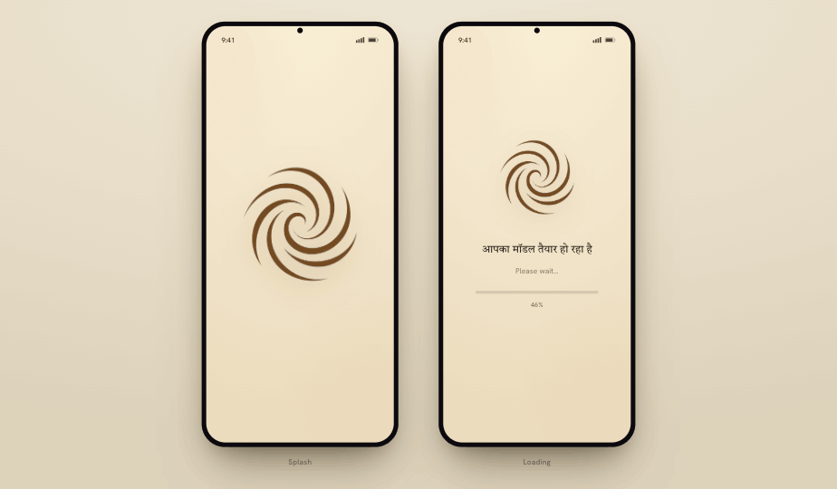

# Handoff: RU — Onboarding screens (Splash · Loading)

Two launch screens for the **RU (Strider Quanto)** Android app — package `com.strider.quanto`. Same warm palette and type system as the main app shell (see `../design_handoff_ru_app_shell/`); this bundle covers only the **splash** and the **model-loading** screen.

Rebuild natively (Activity / Fragment + Views/XML). **Do not embed the HTML in a WebView** — it's the visual source of truth only.

---

## 0. How to use this package

1. Open **`Ru - Onboarding.html`** in a browser. Left = **Splash**, right = **Loading**. The loading bar fills 0→100% then loops; the title cross-fades Hindi ⇄ English.
2. Use **`assets/ru-mark.png`** — the brand swirl with a **transparent background**, already trimmed to a tight bounding box. Drop it straight into `res/drawable*/` (or `mipmap` for the splash icon). 546×526 px source; supply density buckets or a vector if available.
3. Cross-reference `../design_handoff_ru_app_shell/DESIGN_TOKENS.md` for colors / type / spacing — all resources already exist in `res/values/`.

> Both screens are **light theme only**, edge-to-edge, dark icons on the cream background.

---

## 1. Screens

| # | Screen | Purpose | Android target |
|---|---|---|---|
| 01 | **Splash** | Brand hold on cold launch | `SplashScreen` API (`androidx.core.splashscreen`) or a themed launch Activity |
| 02 | **Loading** | "Model is loading" + progress while the on-device model / index warms up | loading Fragment or full-screen `DialogFragment` |



---

## 2. Screen 01 — Splash

- **Background:** flat `ru_bg` #FEF9E6 (the prototype's radial sheen is web-only — use the flat canvas, or a very subtle top-light vignette via a drawable if desired).
- **Logo:** `ru-mark.png`, centered, **≈230 dp** square. Vertical bias ≈ center. Drop shadow is decorative — skip or use a soft 2dp elevation behind a circular container if you want lift.
- Use the official **Android 12+ `SplashScreen`** API: `windowSplashScreenBackground` = `ru_bg`, `windowSplashScreenAnimatedIcon` = the swirl. Keep it on screen only as long as cold-start work needs; hand off to **Loading** when model/index warm-up begins.

## 3. Screen 02 — Loading

Centered vertical stack (`LinearLayout`/`ConstraintLayout` chain), biased to center:

| Element | Spec |
|---|---|
| **Logo** | `ru-mark.png`, **≈150 dp** square, centered |
| **Title** (cross-fade) | 56 dp gap above. **Hindi:** `model_loading_hi` — Tiro Devanagari Hindi, **21sp**. **English:** `model_loading_en` "Your model is loading" — Fraunces, **25sp / 400**. Same baseline; the two swap via cross-fade (see §4). `text_primary` #1A1530. |
| **Subline** | 13 dp below title. "Please wait…" / `model_loading_wait`. Hanken Grotesk **15sp / 400**, `text_secondary` #888888. |
| **Progress track** | 30 dp below subline. **6 dp** tall, radius full, max-width **244 dp**, bg `divider` (5% black). |
| **Progress fill** | `ru_crimson` #C41E3A, radius full, animates left→right. |
| **Percent** | 13 dp below track, centered. Hanken Grotesk **13sp / 600**, tabular figures, `text_secondary`. Shows `0%…100%`, then "Ready" / `model_loading_ready`. |

---

## 4. Behavior

- **Title cross-fade (matches the app's "search anything, anywhere" tagline):** alternate Hindi ⇄ English on a timer. Cross-fade only — fade current out (~600 ms), fade next in. Default cadence ≈ 4.2 s per language. Both strings occupy the **same** centered slot (use a `FrameLayout`/grid stack with both `TextView`s overlaid, animate `alpha`). **Don't animate layout** — only opacity.
- **Progress:** **drive from the real model/index warm-up progress**, not a timer. The prototype uses an ease-out fill purely for demo. Use a determinate `ProgressBar` (or custom view) bound to actual load state; show "Ready" at 100%, then advance to Home.
- **Reduced motion:** if the system "remove animations" setting is on, skip the cross-fade (show one language) and don't animate the fill — set values directly.
- **Insets:** edge-to-edge, respect status/nav bars via `WindowInsetsCompat`.

---

## 5. Tokens used (full tables in `../design_handoff_ru_app_shell/DESIGN_TOKENS.md`)

- **Colors:** `ru_bg` #FEF9E6 · `text_primary` #1A1530 · `text_secondary` #888888 · `ru_crimson` #C41E3A · `divider` 5% black.
- **Type:** Fraunces (serif, 400) — English title; Tiro Devanagari Hindi (400) — Hindi title; Hanken Grotesk (400/600) — subline + percent. Bundle as `res/font` or Downloadable Fonts.
- **Radii:** progress track/fill = full (pill). **Spacing (dp):** logo→title 56 · title→subline 13 · subline→track 30 · track→percent 13.

## 6. Strings (add to `strings.xml`)

```xml
<string name="model_loading_en">Your model is loading</string>
<string name="model_loading_hi">आपका मॉडल तैयार हो रहा है</string>
<string name="model_loading_wait">Please wait…</string>
<string name="model_loading_ready">Ready</string>
```

## 7. Files in this bundle
- `Ru - Onboarding.html` — the two-screen prototype (source of truth).
- `assets/ru-mark.png` — brand swirl, **transparent background**, trimmed (546×526).
- `screenshots/screens.png` — both screens side by side.
